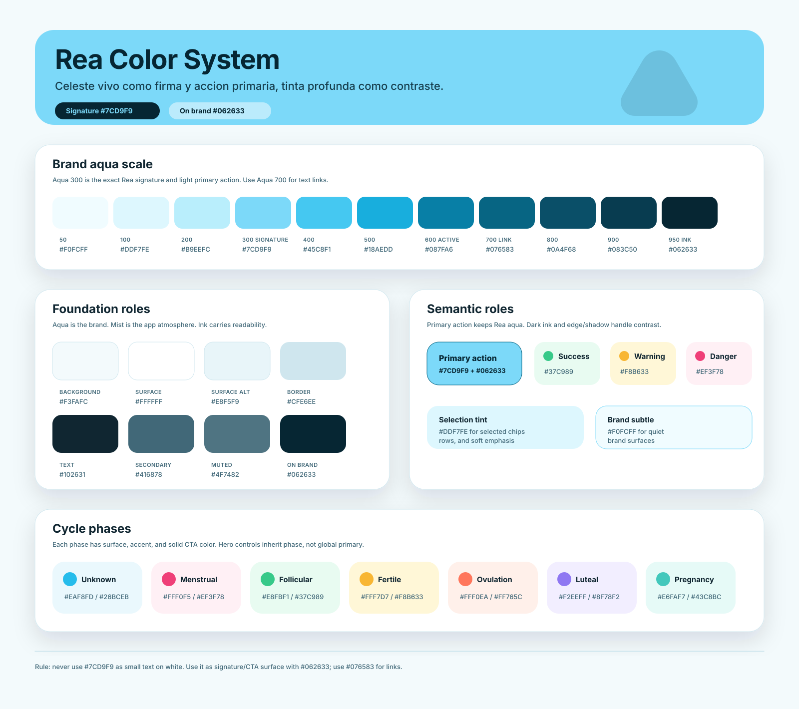
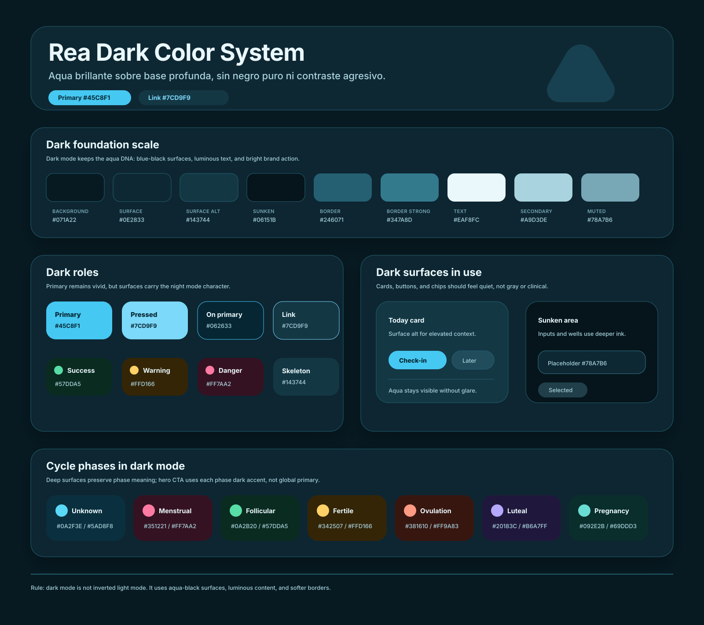

# Rea Color System

## Laminas visuales

### Light mode



### Dark mode



## Proposito

Este documento fija el sistema cromatico de Rea para que el celeste sea una
firma reconocible, no un color decorativo dificil de usar.

Rea es una app intima de ciclo, check-in y educacion. El color debe sentirse:

- cercano, no clinico;
- joven, no infantil;
- luminoso, no apagado;
- confiable, no alarmista;
- propio de Rea, no una paleta generica de salud.

## Decision principal

El color de marca sigue siendo el celeste elegido para Rea:

```ts
aqua[300] = "#7CD9F9";
```

El cambio importante es como se usa:

- No usar `#7CD9F9` como texto pequeno sobre blanco.
- No usar `#7CD9F9` con texto blanco en modo claro.
- Usarlo como firma, superficie grande o tinte de marca con tinta profunda.
- Usar `#076583` solo cuando el acento sea texto pequeno, icono o enlace.

Las combinaciones principales son:

```text
Signature surface: #7CD9F9
Text on signature: #062633
Contrast: 9.87:1

Light primary action: #7CD9F9
Text on light primary: #062633
Contrast: 9.87:1

Dark primary action: #45C8F1
Text on dark primary: #062633
Contrast: 8.09:1
```

Esto permite que Rea sea reconocible por su celeste sin sacrificar legibilidad.

## Paleta base

### Aqua

`aqua` es la escala de marca. Solo `aqua[300]` es la firma principal.

| Token       | Hex       | Uso                              |
| ----------- | --------- | -------------------------------- |
| `aqua[50]`  | `#F0FCFF` | Fondos de marca muy suaves       |
| `aqua[100]` | `#DDF7FE` | Seleccion, chips activos, tintes |
| `aqua[200]` | `#B9EEFC` | Superficies de apoyo             |
| `aqua[300]` | `#7CD9F9` | Firma Rea y accion primaria      |
| `aqua[400]` | `#45C8F1` | Primary en modo oscuro           |
| `aqua[500]` | `#18AEDD` | Acento fuerte puntual            |
| `aqua[600]` | `#087FA6` | Navegacion activa y bordes       |
| `aqua[700]` | `#076583` | Links y texto de accion          |
| `aqua[800]` | `#0A4F68` | Texto profundo secundario        |
| `aqua[900]` | `#083C50` | Superficies oscuras de marca     |
| `aqua[950]` | `#062633` | Tinta sobre marca                |

### Mist

`mist` reemplaza los neutros slate frios. Tiene tinte aqua para que pantallas,
tarjetas, bordes y sombras vivan en el mismo mundo que la marca.

| Token       | Hex       | Uso                       |
| ----------- | --------- | ------------------------- |
| `mist[50]`  | `#F3FAFC` | Fondo base claro          |
| `mist[100]` | `#E8F5F9` | Superficie alternativa    |
| `mist[200]` | `#CFE6EE` | Borde suave               |
| `mist[300]` | `#A9D2DE` | Borde fuerte              |
| `mist[400]` | `#79AABD` | Placeholder suave         |
| `mist[500]` | `#4F7482` | Texto terciario legible   |
| `mist[600]` | `#416878` | Texto secundario          |
| `mist[700]` | `#2C4E5B` | Icono fuerte              |
| `mist[800]` | `#1D3A45` | Superficie oscura elevada |
| `mist[900]` | `#102631` | Texto principal           |
| `mist[950]` | `#071A22` | Fondo base oscuro         |

## Roles semanticos

Las pantallas deben consumir roles semanticos desde `theme.colors`, no escalas
crudas.

| Role            | Light     | Dark      | Proposito               |
| --------------- | --------- | --------- | ----------------------- |
| `background`    | `#F3FAFC` | `#071A22` | Base de la app          |
| `surface`       | `#FFFFFF` | `#0E2833` | Cards, headers, sheets  |
| `surfaceAlt`    | `#E8F5F9` | `#143744` | Panels y bloques suaves |
| `surfaceSunken` | `#DDEEF4` | `#06151B` | Inputs, wells           |
| `border`        | `#CFE6EE` | `#246071` | Separacion limpia       |
| `text`          | `#102631` | `#EAF8FC` | Lectura principal       |
| `textSecondary` | `#416878` | `#A9D3DE` | Descripciones           |
| `textMuted`     | `#4F7482` | `#78A7B6` | Hints y metadata        |
| `primary`       | `#7CD9F9` | `#45C8F1` | Accion principal        |
| `onPrimary`     | `#062633` | `#062633` | Texto sobre accion      |
| `link`          | `#076583` | `#7CD9F9` | Texto de accion         |
| `focusRing`     | `#45C8F1` | `#7CD9F9` | Accesibilidad           |

## Estados

Los estados no compiten con la marca. Viven en superficies suaves y se usan con
texto claro sobre su propio fondo.

| Estado  | Surface   | Accent    | Text      |
| ------- | --------- | --------- | --------- |
| Success | `#E8FBF1` | `#37C989` | `#0E6848` |
| Warning | `#FFF7D7` | `#F8B633` | `#7A4B00` |
| Danger  | `#FFF0F5` | `#EF3F78` | `#8E1E43` |

## Fases del ciclo

Las fases usan color para orientar, no para diagnosticar. Cada fase necesita:

- `surface`: fondo de contexto;
- `accent`: iconos, marcas, series de charts;
- `onSurface`: texto principal;
- `onSurfaceMuted`: texto secundario;
- `solid/onSolid`: CTA interno del hero, siempre derivado de la fase.

| Fase                | Surface   | Accent    | Solid CTA | Uso                        |
| ------------------- | --------- | --------- | --------- | -------------------------- |
| Unknown             | `#EAF8FD` | `#26BCEB` | `#075E7B` | Estimacion insuficiente    |
| Menstrual           | `#FFF0F5` | `#EF3F78` | `#8E1E43` | Sangrado/periodo           |
| Follicular          | `#E8FBF1` | `#37C989` | `#0E6848` | Energia en aumento         |
| Fertile window      | `#FFF7D7` | `#F8B633` | `#7A4B00` | Fertilidad posible         |
| Estimated ovulation | `#FFF0EA` | `#FF765C` | `#A83224` | Pico estimado              |
| Luteal              | `#F2EEFF` | `#8F78F2` | `#4C39A5` | Preparacion/desaceleracion |
| Pregnancy           | `#E6FAF7` | `#43C8BC` | `#096C65` | Predicciones pausadas      |

## Reglas de uso

1. `primary` no significa "texto azul". En light mode es superficie celeste con tinta profunda.
2. Para links sobre fondos claros usar `link = #076583`.
3. Para CTAs en light usar `primary = #7CD9F9` y `onPrimary = #062633`.
4. Dentro del hero de fase, los CTAs no usan `primary`: usan `phase.solid` y
   `phase.onSolid`.
5. No usar blanco sobre `#7CD9F9` en texto pequeno.
6. No usar color de fase como unico significado: siempre acompanar con texto o
   icono.
7. En calendario, observado y estimado deben diferenciarse por forma/patron,
   no solo por color.
8. Evitar grises slate genericos. Si hace falta neutral, usar `mist`.

## Contraste

Contrastes clave verificados por test:

| Par                                | Ratio   |
| ---------------------------------- | ------- |
| `onPrimary` sobre `primary`        | 9.87:1  |
| `link` sobre `background`          | 6.22:1  |
| `text` sobre `background`          | 14.80:1 |
| `textSecondary` sobre `background` | 5.72:1  |
| `textMuted` sobre `background`     | 4.79:1  |

El test `test/unit/theme/theme.test.ts` protege estos roles y todas las fases
contra regresiones AA.

## Archivos fuente

| Archivo                             | Responsabilidad                                             |
| ----------------------------------- | ----------------------------------------------------------- |
| `src/theme/tokens/colors.ts`        | Primitivas crudas: `aqua`, `mist`, `ink`, `status`, `phase` |
| `src/theme/themes/light.ts`         | Mapeo semantico para modo claro                             |
| `src/theme/themes/dark.ts`          | Overrides para modo oscuro                                  |
| `src/theme/tokens/elevation.ts`     | Sombras tintadas con tinta Rea                              |
| `docs/design/color-system.svg`      | Lamina visual del sistema en modo claro                     |
| `docs/design/color-system-dark.svg` | Lamina visual del sistema en modo oscuro                    |

## Referencia Expo

El proyecto usa Expo SDK 56 y Expo Router desde `expo-router`. La revision de
tema no introduce API nueva ni dependencia visual adicional.
